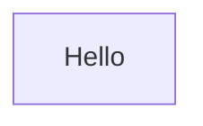
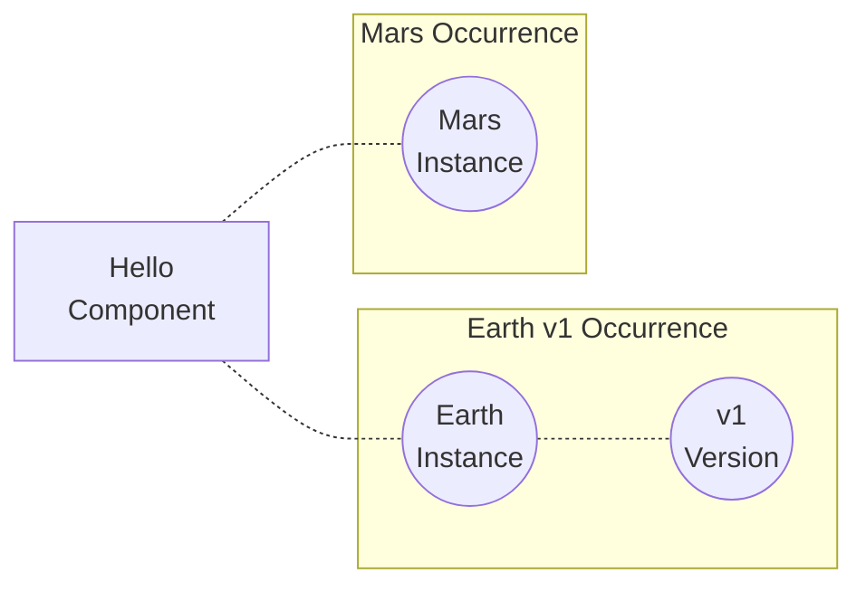

# Getting Started

The intention of this guide is to give you an understanding of the CodeOnTap core concepts and how they can be applied when deploying applications and their supporting infrastructure.

The guide works through the deployment of [codeontap hello](https://github.com/codeontap/docker-hello), a simple hello world website built using [Flask](https://www.palletsprojects.com/p/flask/) and hosted in a [docker container](https://https://hub.docker.com/repository/docker/codeontap/hello). To host the application we will use [AWS](https://aws.amazon.com/) and this guide will cover deploying the application itself along with the supporting infrastructure required for the app to run

Let's start with the concepts...

## Building a Machine



Here is our container, it performs a specific function within our application, saying `Hello!`. While it might have dependencies on other components, it still acts as an independent unit. In CodeOnTap this unit is called a **component**, they form the basis of deploying infrastructure within CodeOnTap.

If we run this container locally and access its over http we meet our hello application and it lets us know where it is

```bash
curl http://localhost:8000

{
  "Greeting": "Hello!",
  "Location": "local"
}
```

If we wanted to say `Hello!` from multiple locations we would need to deploy multiple containers and update the location for each one. Our component is performing the same function but with different run time configuration. In CodeOnTap we can specify **instances** which can optionally have **versions** of our components. This allows us to override specific properties for a given instance or version while inherting the rest from the component configuration.

A given instance and version of a component is called an **occurrence**.



Components have a **type** which defines the infrastructure required to provide this function. For hosting containers we have two types available, **services** which uses a container orchestrator (kubernetes, ecs etc.) to ensure the container is always running, and **tasks** which are run on demand, complete a specific task and then exit.

We want to say `Hello!` all the time so we will make the type of this component a **service**

Each type has it's own configuration that defines specifically how this component should behave, memory and cpu allocation, exposed network ports and connections to load balancers are all part of the component configuration.

!!! note
    This is a section of the configuration for a service. To see all of the component types and their configuration options head to the [configuration reference](http://127.0.0.1:8000/reference/component-reference/) page
    ```json
    {
        "service" : {
            "Engine" : "ec2",
            "Containers" : {
                "example" : {
                    "Cpu" : "<number>",
                    "Links" : {
                        "example" : {
                            "Tier" : "",
                            "Component" : "",
                            "Instance" : "",
                            "Version" : "",
                            "Enabled" : true
                        }
                    },
                    "MaximumMemory" : "<number>",
                    "MemoryReservation" : "<number>",
                    "Ports" : {
                        "example" : {
                            "Container" : "unknown",
                            "DynamicHostPort" : false,
                            "LB" : {
                                "Tier" : "<string>",
                                "Component" : "<string>",
                                "LinkName" : "lb",
                                "Instance" : "<string>",
                                "Version" : "<string>",
                                "PortMapping" : "<string>"
                            }
                        }
                    },
                    "Version" : "<string>",
                    "ContainerNetworkLinks" : "<array of string>"
                }
            },
            "DesiredCount" : -1,
            "Permissions" : {
                "Decrypt" : true,
                "AsFile" : true,
                "AppData" : true,
                "AppPublic" : true
            },
            "NetworkMode" : "<string>"
        }
    }
    ```

In most IT systems we don't just deploy one component, we deploy a collection of components which work together to provide a specific service. In CodeOnTap this collection is called a **Solution**, the components that make up the solution have a set of dependent relationships between one another and we define these relationships between as **Links**. Links allow components to share properties between one another and can also be used to determine the configuration of a component.

To make sure we can say `Hello!` all of the time we configure our service to deploy 2 copies of the same container, and so we can access both of them using the same URL we add a load balancer to our **Solution**

```mermaid
    graph LR;

    loadbalancer{{ Hello-LB <br> Load Balancer }}

    loadbalancer --- containerA
    loadbalancer --- containerB

    subgraph Hello <br> Service
    containerA[ A ]
    containerB[ B ]
    end
```

To create this relationship in CodeOnTap we create a link from the `Hello` component to the `Hello-LB` component. When we deploy this infrastructure the container will be configured to register with the load balancer which will send traffic to either copy of the `Hello` Service.
